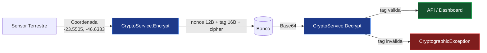

<div align="center">

# orbital-trust-sec

### Módulo de Cibersegurança · Orbital Trust
**Global Solution · 1º Semestre 2026**

[](https://dotnet.microsoft.com/)
[](https://en.wikipedia.org/wiki/Galois/Counter_Mode)
[](https://www.fiap.com.br/)
[]()

> Criptografia autenticada de dados geográficos sensíveis em sensores terrestres,
> integrada ao pipeline do Orbital Trust.

</div>

---

## Destaques

- **Criptografia AEAD** com AES-256-GCM no campo `Coordenada` da entidade `SensorTerrestre`
- **Mitigação dupla** — Information Disclosure (confidencialidade) + Tampering (autenticação)
- **Zero dependências externas** — apenas a BCL do .NET (`System.Security.Cryptography`)
- **Três cenários** demonstram roundtrip, unicidade de ciphertext e detecção de adulteração
- **Justificativa técnica** documentada — por que GCM e não CBC

---

## Sumário

1. [Sobre o projeto](#sobre-o-projeto)
2. [Sobre este repositório](#sobre-este-repositório)
3. [Ameaça mitigada](#ameaça-mitigada)
4. [Implementação prática — AES-256-GCM](#implementação-prática--aes-256-gcm)
5. [Fluxo de criptografia](#fluxo-de-criptografia)
6. [Exemplo de uso](#exemplo-de-uso)
7. [Controles de segurança no Orbital Trust](#controles-de-segurança-no-orbital-trust)
8. [Estrutura do projeto](#estrutura-do-projeto)
9. [Como rodar](#como-rodar)
10. [Decisões de design](#decisões-de-design)
11. [Considerações para produção](#considerações-para-produção)
12. [Evidências](#evidências)
13. [Bibliotecas utilizadas](#bibliotecas-utilizadas)
14. [Referências](#referências)
15. [Integrantes](#integrantes)

---

## Sobre o projeto

O **Orbital Trust** é uma plataforma de monitoramento ambiental que combina
**dados satelitais** com **sensores visuais terrestres** para gerar alertas
confiáveis sobre queimadas, desmatamento, enchentes e seca.

O diferencial é o **Índice de Confiabilidade Orbital (ICO)** — cruzamento entre
a análise do modelo de Machine Learning e a detecção visual em tempo real.

---

## Sobre este repositório

Implementação prática do módulo de cibersegurança entregue na disciplina
**Cibersegurança 1** (Prof. MSc. Oerton Fernandes), integrada ao projeto da GS.

---

## Ameaça mitigada

Análise via modelo **STRIDE**:

| Ameaça STRIDE              | Vetor                                              | Mitigação aplicada                  |
|----------------------------|----------------------------------------------------|-------------------------------------|
| **Information Disclosure** | Vazamento do banco → coordenadas em texto claro    | AES-256-GCM no campo `Coordenada`   |
| **Tampering**              | Adulteração de bytes do registro no banco          | Autenticação AEAD (tag GCM)         |

> Sem o controle: um dump do banco exporia a **localização exata** de cada
> sensor — informação operacionalmente crítica e potencialmente sensível para
> segurança física dos equipamentos.

---

## Implementação prática — AES-256-GCM

Criptografia **AES-256 em modo GCM** aplicada ao campo `Coordenada` da entidade
`SensorTerrestre` **antes** da persistência no banco.

### Por que GCM e não CBC?

| Critério                       | CBC                              | **GCM**                          |
|--------------------------------|----------------------------------|----------------------------------|
| Confidencialidade              | Sim                              | Sim                              |
| Autenticação / integridade     | Requer HMAC separado             | Embutida (AEAD)                  |
| Padding oracle                 | Vulnerável                       | Não se aplica                    |
| Performance                    | Boa                              | Comparável (instruções AES-NI)   |
| Detecção de tampering          | Silenciosa                       | `CryptographicException`         |

O modo **GCM** inclui autenticação embutida (AEAD — *Authenticated Encryption
with Associated Data*). Se um atacante adulterar o dado no banco, o `Decrypt`
lança `CryptographicException` **antes** de retornar qualquer dado, eliminando
a classe de ataques de padding oracle.

### Parâmetros criptográficos

| Parâmetro          | Valor                  | Justificativa                                              |
|--------------------|------------------------|------------------------------------------------------------|
| Algoritmo          | AES                    | Padrão NIST FIPS-197                                       |
| Tamanho da chave   | 256 bits               | Margem contra ataques quânticos (Grover ⇒ 128-bit security)|
| Modo               | GCM                    | AEAD — confidencialidade + autenticidade num único passo   |
| Nonce              | 96 bits (12 bytes)     | Recomendação NIST SP 800-38D — formato canônico do GCM     |
| Tag de autenticação| 128 bits (16 bytes)    | Maior nível de segurança suportado pelo GCM                |
| Geração de nonce   | `RandomNumberGenerator`| CSPRNG — único por mensagem (requisito crítico do GCM)     |

---

## Fluxo de criptografia



### Estrutura do ciphertext serializado

```
┌─────────────┬─────────────┬──────────────────────┐
│ nonce (12B) │  tag (16B)  │ ciphertext (n bytes) │
└─────────────┴─────────────┴──────────────────────┘
                      ↓
                Base64 encode
                      ↓
      persistido no campo `Coordenada`
```

O nonce vai junto do ciphertext porque é necessário para descriptografar —
**não é segredo**, apenas precisa ser único por mensagem sob a mesma chave.

---

## Exemplo de uso

```csharp
using OrbitalTrust.Security;

// Persistência: criptografa antes de salvar
var coordenada = "-23.5505, -46.6333";
sensor.Coordenada = CryptoService.Encrypt(coordenada);
db.SensoresTerrestres.Add(sensor);
await db.SaveChangesAsync();

// Leitura: descriptografa após buscar
var registro = await db.SensoresTerrestres.FindAsync(id);
var coord = CryptoService.Decrypt(registro.Coordenada);
// → "-23.5505, -46.6333"

// Detecção de adulteração
try
{
    CryptoService.Decrypt(dadoAdulterado);
}
catch (CryptographicException)
{
    // tag inválida — registro foi alterado no banco
    logger.LogCritical("Tampering detectado no sensor {Id}", id);
}
```

---

## Controles de segurança no Orbital Trust

| #   | Controle                          | Tipo            | Aplica em                                  |
|:---:|-----------------------------------|-----------------|--------------------------------------------|
|  1  | TLS/HTTPS obrigatório             | Preventivo      | API de Alertas                             |
|  2  | Autenticação + Roles IAM          | Preventivo      | API — sensor_node / analyst / admin        |
|  3  | **AES-256-GCM em coordenadas**    | **Preventivo**  | **Banco — campo Coordenada** ← este repo   |
|  4  | Monitoramento de logs             | Detectivo       | API + Banco                                |
|  5  | mTLS para IoT                     | Preventivo      | Nó Sensor / Câmera                         |

---

## Estrutura do projeto

```
orbital-trust-sec/
├── src/
│   └── CryptoService/
│       ├── CryptoService.cs            ← Encrypt / Decrypt (AES-256-GCM)
│       ├── Program.cs                  ← 3 cenários demonstrativos
│       └── CryptoService.csproj
├── tests/
│   └── CryptoService.Tests/
│       ├── CryptoServiceTests.cs       ← suíte xUnit (roundtrip, tampering, nonce)
│       └── CryptoService.Tests.csproj
├── evidencias/
│   ├── output.txt                      ← saída completa da execução
│   └── print_execucao.png              ← screenshot do terminal
├── .gitignore
└── README.md
```

---

## Como rodar

> **Requisito:** .NET 10 SDK

```bash
cd src/CryptoService
dotnet run
```

### Chave de criptografia

A chave é lida da variável de ambiente `ORBITAL_TRUST_KEY` (Base64 de 32 bytes).
Se não definida, usa uma chave de demonstração — **adequado apenas para esta
entrega**, jamais para produção.

```bash
# PowerShell
$env:ORBITAL_TRUST_KEY = [Convert]::ToBase64String((1..32 | ForEach-Object { Get-Random -Maximum 256 }))
dotnet run

# bash
export ORBITAL_TRUST_KEY=$(openssl rand -base64 32)
dotnet run
```

### Rodando os testes

```bash
cd tests/CryptoService.Tests
dotnet test
```

### Output esperado

```text
╔══════════════════════════════════════════════════════╗
║     ORBITAL TRUST — CryptoService  |  GS 2026        ║
║     Cibersegurança 1  ·  FIAP  ·  Turma 3ESR         ║
╚══════════════════════════════════════════════════════╝

[ CENÁRIO 1 ]  Campo: SensorTerrestre.Coordenada
  Original              : -23.5505, -46.6333
  Criptografado (Base64): <valor único a cada execução>
  Descriptografado      : -23.5505, -46.6333
  Integridade OK        : True

[ CENÁRIO 2 ]  Campo: SensorTerrestre.Coordenada (segundo sensor)
  Original              : -15.7801, -47.9292
  Criptografado (Base64): <valor único a cada execução>
  Descriptografado      : -15.7801, -47.9292
  Integridade OK        : True

[ CENÁRIO 3 ]  Tamper detection
  Adulteração detectada : CryptographicException lançada.
```

### Cenários demonstrados

| Cenário | O que prova                                                  |
|:-------:|--------------------------------------------------------------|
|    1    | Roundtrip Encrypt → Decrypt preserva o dado original         |
|    2    | Nonces aleatórios produzem ciphertexts distintos por execução|
|    3    | Adulteração de 1 byte → `CryptographicException` (AEAD)      |

---

## Decisões de design

| Decisão                                | Alternativa descartada        | Motivo                                                        |
|----------------------------------------|-------------------------------|---------------------------------------------------------------|
| AES-256-GCM (AEAD)                     | AES-CBC + HMAC                | GCM resolve tudo num único passo — sem risco de padding oracle|
| Nonce aleatório de 96 bits             | Nonce determinístico (contador)| Não exige estado compartilhado entre serviços                |
| Serialização `nonce ‖ tag ‖ cipher`    | Campos separados no banco     | Um único campo Base64 simplifica migração e ORM               |
| Tag de 128 bits                        | Tag de 96 / 112 bits          | Máxima resistência a forjamento sem custo significativo       |
| Chave estática no código (demo)        | Variável de ambiente / Vault  | Apenas para evidência de execução — ver seção abaixo          |

---

## Considerações para produção

Esta entrega é um **proof of concept** para a disciplina. Para deploy em
produção, o gerenciamento de chave precisa ser endereçado:

| Tópico                  | Estado atual              | Roadmap para produção                         |
|-------------------------|---------------------------|-----------------------------------------------|
| Origem da chave         | Constante no código       | Azure Key Vault / AWS KMS / HashiCorp Vault   |
| Rotação                 | Não aplicável             | Versionar chaves (header com `key_id`)        |
| Auditoria de acesso     | Inexistente               | Log de cada operação Encrypt/Decrypt          |
| Re-criptografia em massa| Não previsto              | Job de rotação batch com `key_id` versionado  |
| Hardening do binário    | Build padrão              | Assinatura de assembly + reproducible builds  |

> A chave de demonstração no código fonte está marcada com comentário explícito
> indicando que **não deve ser usada em produção**.

---

## Evidências

Ver pasta [`/evidencias`](./evidencias):

| Arquivo               | Conteúdo                                |
|-----------------------|-----------------------------------------|
| `output.txt`          | Output completo da execução             |
| `print_execucao.png`  | Screenshot do terminal                  |

---

## Bibliotecas utilizadas

| Biblioteca                      | Origem            | Observação                          |
|---------------------------------|-------------------|-------------------------------------|
| `System.Security.Cryptography`  | built-in .NET 10  | Sem dependências externas           |
| `System.Text`                   | built-in .NET 10  | Encoding UTF-8                      |
| `xUnit 2.9`                     | testes            | Apenas em `CryptoService.Tests`     |

**Zero dependências externas** — apenas a BCL do .NET.

---

## Referências

- [NIST SP 800-38D](https://nvlpubs.nist.gov/nistpubs/Legacy/SP/nistspecialpublication800-38d.pdf) — *Recommendation for Block Cipher Modes of Operation: Galois/Counter Mode (GCM) and GMAC*
- [NIST FIPS-197](https://nvlpubs.nist.gov/nistpubs/FIPS/NIST.FIPS.197.pdf) — *Advanced Encryption Standard (AES)*
- [OWASP Cryptographic Storage Cheat Sheet](https://cheatsheetseries.owasp.org/cheatsheets/Cryptographic_Storage_Cheat_Sheet.html)
- [Microsoft Docs — `AesGcm` Class](https://learn.microsoft.com/dotnet/api/system.security.cryptography.aesgcm)
- [STRIDE Threat Model](https://learn.microsoft.com/azure/security/develop/threat-modeling-tool-threats) — Microsoft

---

## Integrantes

<div align="center">

| Nome                          | RM         |
|-------------------------------|:----------:|
| Victor Dias                   | RM558017   |
| Gustavo Paulino               | RM554779   |
| Guilherme Abe                 | RM554743   |
| Fernando Luiz                 | RM555201   |
| Thomas Reichmann              | RM554812   |

**FIAP · 3ESR · 2026**

</div>
